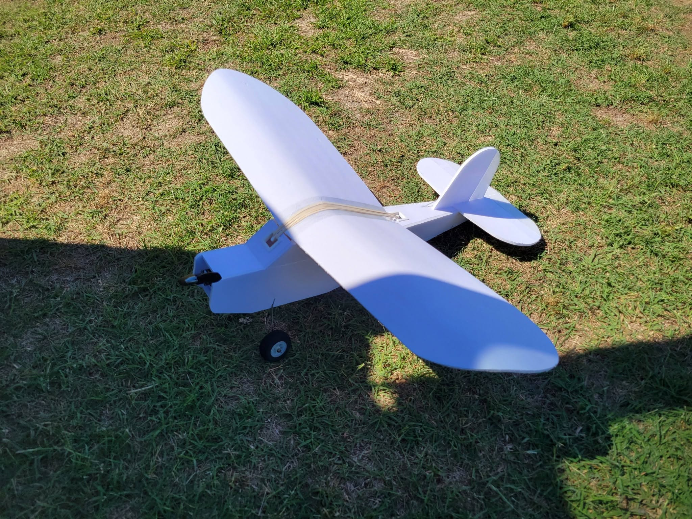

# P1

## Project Brief
| Field | Details |
|---|---|
| Project Type | UAV Build |

## Overview
## Purpose
## Problem / Need
## Scope
- Included:
- Not included:
- [ ] sadsad


## Hardware / Tools Used
| No. | Code | Part Number | Description | Qty | UOM | Purpose | Cost | Supplier | Image | Notes |
|---|---|---|---|---|---|---|---|---|---|---|
| 1 | asfsadf | sadf | asfdasf | fasdf | AD | Dad | sD | SAD |  |  |
| 2 | ad | ASD | das | sad | sd | SAds | sD | Sd |  |  |
| 3 | asdf | af | faf | asfa | asdf | adsdafasf | SAD | dsD |  |  |

## Documentation
- [Overview](docs/overview.md)
- [Build Notes](docs/build_notes.md)
- [Testing](docs/testing.md)
- [Results](docs/results.md)
- [Future Work](docs/future_work.md)

## Build Notes Summary
## Build Summary
## Implementation Steps

## Testing Summary
## Test Objective
## Test Setup
- Date:
- Location:
- Equipment:
- Configuration:

## Results Summary
## Result Summary
## Evidence
- Photos:
- Logs:
- Measurements:
- References:
## Interpretation

## Project Structure
```text
P1/
├── README.md
├── docs/
│   └── revisions/
├── images/
├── parts/
├── tests/
├── logs/
├── references/
└── exports/
```

---
Generated with CodeM.
