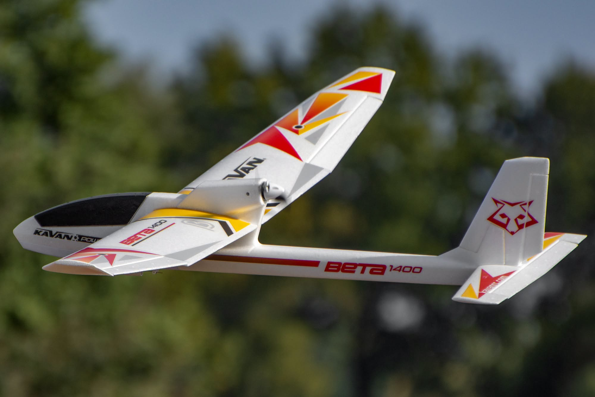
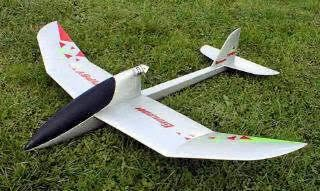

# P1

## Objective
State the main objective of the project.

## Project Type
General Project

## Overview
## Purpose
State what this project is intended to accomplish.

## Problem / Need
Explain the problem, requirement, or opportunity that led to this project.

## Scope
- Included:
- Not included:


## Objectives



## Hardware / Tools Used
| No. | Code | Part Number | Description | Qty | UOM | Purpose | Cost | Supplier | Image | Notes |
|---|---|---|---|---|---|---|---|---|---|---|
| 1 | asfsadf | sadf | asfdasf | fasdf | AD | Dad | sD | SAD |  |  |
| 2 | ad | ASD | das | sad | sd | SAds | sD | Sd |  |  |
| 3 | asdf | af | faf | asfa | asdf | adsdafasf | SAD | dsD |  |  |

## Build Notes
## Build Summary
Briefly describe what was built, assembled, configured, or changed.

## Implementation Steps
1.
2.
3.

## Design Decisions
- Decision:
- Reason:

## Issues and Fixes
- Issue:
- Cause:
- Fix:

## Testing
## Test Objective
State what the test is intended to verify.

## Test Setup
- Date:
- Location:
- Equipment:
- Configuration:

## Test Procedure
1.
2.
3.

## Test Outcome
- Pass / Fail:
- Notes:

## Results
## Result Summary
Briefly state the final or current outcome.

## Evidence
- Photos:
- Logs:
- Measurements:
- References:

## Interpretation
Explain what the evidence means and why it matters.

## Future Work
List improvements, next steps, and research continuation.

## Repository Structure
```text
.
├── README.md
├── project.json
├── docs/
│   └── revisions/
├── images/
├── parts/
├── tests/
├── logs/
├── references/
└── exports/
```

## Generated By
CodeM — Research-to-GitHub Compiler

## License
MIT License
